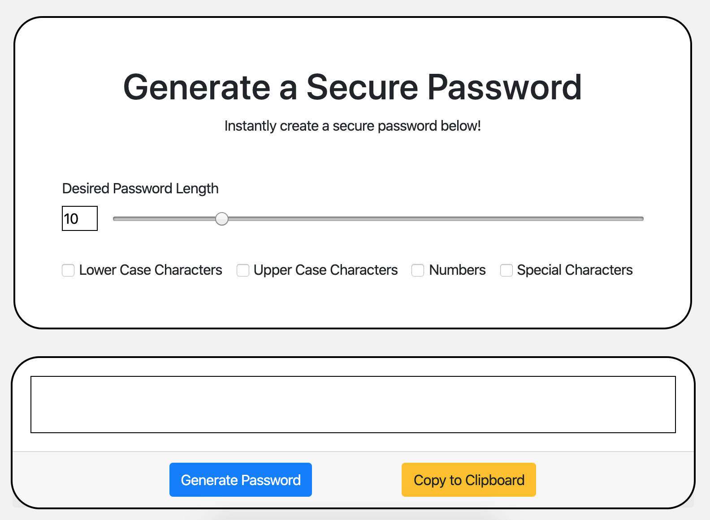

# open_sesame
A simple and easy tool to generate a secure password.

# Description

This is an application that generates a random password based on user-selected criteria. 

The user will be given the following password criteria:

Length (between 1 and 50 characters)

Character type:

- Uppercase characters

- Lowercase characters

- Numbers

- Special characters (i.e. symbols)

Once the user selects their desired criteria, they can press "Generate Password" and a password will be generated. The user has the option of copying the given password or click on the "Copy to Clipboard" button and it will be copied for the user to be able to paste it to wherever they want. 

# Technologies Used 
- HTML5
- CSS3
- JavaScript
- Bootstrap

 

# Link
Github Page: https://github.com/kshiraishi22/open_sesame

